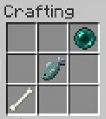
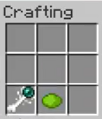
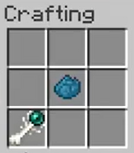
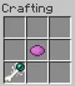

# PolyPlot

Mod for Minecraft Forge with Minecraft v1.12.2.

Curseforge: https://www.curseforge.com/minecraft/mc-mods/polyplot

Youtube Demo: https://www.youtube.com/watch?v=iZ_u5vh_u4w

## Specifications
### Features:

- New Items:
  - Wierd Wand (effectively inert, used for crafting the other three wands)
  - Banagon's Wand
  - Banagon's Wand of Spires
  - Banagon's Wand of Barriers

- New Functionality:
  - Create protected polygonal zones ('plots') in any dimension (plots with spires or barriers are restricted to the overworld).
  - Generate up to three plots using any of the three wands.
  - Remove a plot using any of the three wands.
  - Rejects block placement/removal in/from plots by foreign players.
  - Plots generated by a Wand of Spires generates a 3-block-high pillars at the plot's corners.
  - Plots generated by a Wand of Barriers generates a 3-block-high pillars at the plot's corners, and 3-block-high walls along the plot's edges.
  - Alerts players upon entering/leaving a foreign player's plot.
  - Customize plot entry/exit messages by changing a wand's display name using an anvil.
  
- New server console commands:
    - /pp_ls: list all plots
    - /pp_setPillarConfig: set blockstate configuration for pillars
    - /pp_setWallConfig: set blockstate configuration for walls

### Planned Features for the Future

- New Items:
  - 3 lore books, adding some background lore to why the wands exist, that can be found randomly in generated chests.

- New Functionality:
  - Allow plots to have multiple owners.
  - Allow plots with pillars and walls to be created in non-overworld dimensions.
  - Enable rendering of plot borders/area for plot owners and server op's while holding wands.
  - Plot area protects from explosions damage.
  - Plot area protects from interactive modification by foreign players (i.e. opening a chest).

- New Server Console Commands:
  - /pp_deletePlot: forcibly delete a plot from the server

- Fixes:
  - Fix bug where walls generated and protected plot area doesn't line up exactly.
  
# User Manual

## Crafting Recipes

### Wierd Wand (Shaped Recipe)

|Wierd Wand|
|---|
||

### Banagon's Wand (Non-Shaped recipe)

|Banagon's Wand| Banagon's Wand of Spires| Banagon's Wand of Barriers|
|---|---|---|
||||

## Plots

### Create

#### Steps

1. To begin your plot, wield one of Banagon's Wands on your item bar.
2. Right click a block on the ground to begin your plot. This is your 'origin' block.
3. Right click somewhere that isn't the origin block to create a new vertex for your plot.
4. Repeat step 3 until you have added all desired points to your polygon.
5. Right click your 'origin' block to complete the plot.

> Note: If you are using Banagon's Wand of Barriers, and your plot extends across open air, the 

#### Quit creating a plot

If you start drawing a plot but put put a polygon point somewhere you don't want or otherwise mess up your shape, you can abandon the drawing process by right clicking towards the sky with one of the Banagon's Wands.

#### Restrictions

- Plot polygons may not have overlapping edges.
- A player can have at most 3 plots.
- A plot polygon can have at most 30 points.
- The dimensions of the square that circumscribes the plot polygon can not be greater than 100 x 100 blocks.

### Delete

To delete your plot, wield any of the Banagon's Wands and right click the ground three times inside of your plot area.

### Customise Plot Name

To customise the name of your plot that shows up to other players when they enter and exit your plot territory, rename the wand using an anvil.

# Development

## Build

Java JDK 8 is required at this time.

```bash
sudo apt install openjdk-8-jdk
```

First run the server, and then run the client to connect to the server in another shell.

```bash
./gradlew runServer
```

then

```bash
./gradlew runClient
```

You may have to chmod the gradlew file to be executable.